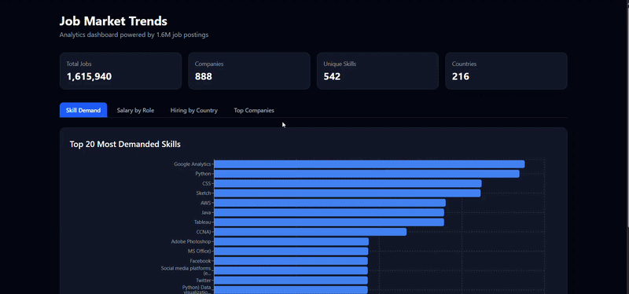

# Job Market Trends Analytics Platform

An end-to-end data engineering project that ingests, transforms, and visualizes **1.6 million real-world job postings** to surface insights on skill demand, salary ranges, hiring patterns, and top companies.

Built as a portfolio project to demonstrate a full data engineering stack — from raw data ingestion to a live analytics dashboard.

---

## Live Demo

- **Dashboard:** https://job-market-trends.vercel.app
- **API:** https://job-trends-api.onrender.com/docs



---

## Architecture

```
Kaggle CSV Dataset (1.6M rows)
         ↓
Python Ingestion Script
(pandas + psycopg2)
         ↓
PostgreSQL 15 (Docker)
6 normalized tables
2.7M job-skill relationships
         ↓
dbt Transformation Layer
Staging views + Analytics mart tables
         ↓
FastAPI REST API
         ↓
React + Recharts Dashboard
```

---

## Features

- **Skill Demand** — Top 20 most in-demand skills ranked by job count
- **Salary Intelligence** — Average, min, and max salary by role
- **Geographic Hiring** — Job volume by country
- **Company Insights** — Top hiring companies with salary data
- **Summary Stats** — Total jobs, companies, skills, and countries at a glance

---

## Tech Stack

| Layer | Technology |
|---|---|
| Containerization | Docker + Docker Compose |
| Database | PostgreSQL 15 |
| DB GUI | pgAdmin 4 |
| Ingestion | Python, pandas, psycopg2 |
| Transformation | dbt (data build tool) |
| Backend API | FastAPI + Uvicorn |
| Frontend | React + Vite |
| Charts | Recharts |
| Styling | Tailwind CSS |
| CI/CD | GitHub Actions |
| Deployment | Vercel + Render |
| Version Control | Git + GitHub |

---

## Database Schema

```
raw_jobs          — exact copy of Kaggle CSV (source of truth)
jobs              — normalized job postings (1.6M rows)
companies         — deduplicated company records (888 unique)
locations         — city/country with coordinates (216 unique)
skills            — normalized skill names (542 unique)
job_skills        — junction table (2.7M relationships)
```

### Entity Relationships
- `companies` → `jobs` (one to many)
- `locations` → `jobs` (one to many)
- `jobs` ↔ `skills` via `job_skills` (many to many)

---

## dbt Models

### Staging Layer (views)
| Model | Description |
|---|---|
| `stg_jobs` | Cleaned job postings with derived salary average |
| `stg_companies` | Normalized company records |
| `stg_locations` | Clean location data |
| `stg_skills` | Filtered skill names |

### Mart Layer (tables)
| Model | Description |
|---|---|
| `most_demanded_skills` | Skills ranked by job count |
| `salary_by_role` | Avg/min/max salary per role |
| `hiring_by_country` | Job volume ranked by country |
| `top_hiring_companies` | Companies ranked by postings |
| `skill_trends_by_month` | Skill demand over time |

---

## CI/CD Pipeline

Every push to `main` automatically:
1. Triggers a Render redeploy of the FastAPI backend
2. Rebuilds and deploys the React frontend to Vercel

---

## Project Structure

```
job-trends/
├── .github/
│   └── workflows/
│       └── deploy.yml          # CI/CD pipeline
├── docker-compose.yml          # PostgreSQL + pgAdmin containers
├── .env                        # DB credentials (not committed)
├── .gitignore
├── README.md
├── demo.gif                    # Dashboard demo
│
├── db/
│   └── init.sql                # Schema — all CREATE TABLE statements
│
├── ingestion/
│   ├── ingest.py               # Main ingestion pipeline
│   └── ingest_skills.py        # Skills + job_skills ingestion
│
├── dbt/
│   └── job_trends/
│       ├── models/
│       │   ├── staging/        # Cleaning + renaming raw data
│       │   └── marts/          # Analytics-ready aggregations
│       ├── dbt_project.yml
│       └── profiles.yml
│
└── frontend/
    ├── src/
    │   ├── pages/              # SkillDemand, SalaryByRole, etc.
    │   ├── components/         # Summary stats card
    │   └── App.jsx             # Tab navigation
    └── vite.config.js
```

---

## How to Run Locally

### Prerequisites
- Docker Desktop
- Python 3.10+
- Node.js 18+

### 1. Clone the repo
```bash
git clone https://github.com/Yesbol466/job-market-trends.git
cd job-market-trends
```

### 2. Set up environment variables
Create a `.env` file in the root:
```env
POSTGRES_USER=admin
POSTGRES_PASSWORD=admin123
POSTGRES_DB=job_trends
PGADMIN_EMAIL=admin@admin.com
PGADMIN_PASSWORD=admin123
```

### 3. Start the database
```bash
docker-compose up -d
```

### 4. Download the dataset
Download the Kaggle dataset and place it at:
```
ingestion/job_description.csv
```

### 5. Run ingestion
```bash
pip install pandas psycopg2-binary python-dotenv
python ingestion/ingest.py
python ingestion/ingest_skills.py
```

### 6. Run dbt transformations
```bash
cd dbt/job_trends
pip install dbt-postgres
dbt run --profiles-dir .
```

### 7. Start the backend
```bash
cd ../../
pip install fastapi uvicorn
uvicorn backend.main:app --reload
```

### 8. Start the frontend
```bash
cd frontend
npm install
npm run dev
```

Open `http://localhost:5173`

---

## Data Pipeline Flow

```
1. Raw CSV → raw_jobs table (exact copy, no changes)
2. raw_jobs → jobs, companies, locations (normalized)
3. Skills string parsed → skills + job_skills tables
4. dbt staging models → clean views
5. dbt mart models → analytics tables
6. FastAPI → exposes analytics as REST endpoints
7. React → consumes API and renders charts
```

---

## Key Engineering Decisions

**Raw layer preserved** — The original CSV data is always kept in `raw_jobs` unchanged. All transformations happen downstream, so the pipeline can always be rerun from scratch.

**Skills normalized** — Skills are stored as individual records in a junction table rather than JSON arrays, enabling proper trend analysis queries.

**Batch inserts** — Ingestion uses `execute_values` with batches of 5,000 rows for performance on 1.6M records.

**dbt separation** — Staging and mart layers are kept separate. Staging cleans and renames, marts aggregate and analyze.

**Dataset size** — The live demo runs on a 10,000 row sample due to free tier database limits. The full pipeline handles 1.6M rows locally.

---

## Roadmap

- [x] Deploy backend on Render
- [x] Deploy frontend on Vercel
- [x] GitHub Actions CI/CD pipeline
- [ ] Add Kubernetes manifests for container orchestration
- [ ] Add Airflow DAGs for scheduled pipeline runs
- [ ] Replace synthetic dataset with live scraped data

---

## Author

**Yesbol** — Data Engineering Portfolio Project

[GitHub](https://github.com/Yesbol466)
